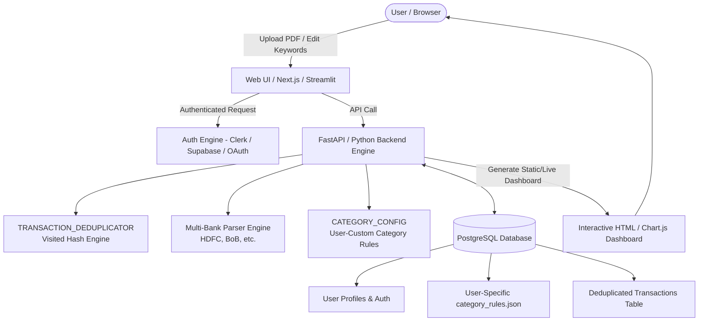

# 💳 Spending Analysis & Personal Financial Intelligence Platform

> **Author**: Shreyas S Bagi  
> **Domain**: VLSI & Hardware Engineering (Designing this personal finance data pipeline for learning & family budget planning)  
> **Target Audience**: Personal Financial Budgeting, House Loan EMI Planning & Family Reporting  
> **Supported Banks**: HDFC Bank (Salary Account), Bank of Baroda (Savings Account), and extensible to any bank.

---

## 🎯 Problem Statement & Goal
As an engineer navigating personal finances, budgeting for a **House Loan EMI**, and sharing clear monthly summaries with parents, this tool automates the ingestion of raw bank statement PDFs and text exports. 

It provides:
1. **Automated Multi-Bank Statement Ingestion & Classification**: Drops all PDF statements into `BANK_STATEMENT/`, automatically identifies the bank format, and categorizes every single transaction.
2. **Deterministic Deduplication Engine (Visited Hash Algorithm)**: Safely handles overlapping statements (e.g., uploading a 6-month consolidated statement and single-month statements simultaneously) without duplicating transactions.
3. **Interactive Visual Dashboard for Family Review**: Generates a self-contained, offline-ready HTML dashboard with interactive monthly tabs, category spending breakdowns, weekly spending trends, recurring payment trackers, and instant search.
4. **Audit Trail & High-Value Transaction Isolation**: Flags uncategorized transactions (> ₹500) for budget tuning and provides separate per-bank (`_HDFC.txt`, `_BoB.txt`) and unified processing logs.

---

## 🏗️ Project Architecture & Clean Directory Structure

```text
BANK/
├── category_rules.json                     # Centralized category rules & keywords (JSON format)
├── SRC_CODES/                              # Core Python source code & modular engines
│   ├── CATEGORY_CONFIG.py                  # Core classification engine & JSON rule loader
│   ├── CONSOLIDATED_BANK_STATEMENT_PARSER.py  # 🌟 Master Multi-Bank Runner (Scans, merges & aggregates)
│   ├── HDFC_BANK_STATEMENT_PARSER.py       # HDFC Bank statement parser
│   ├── BOB_BANK_STATEMENT_PARSER.py        # Bank of Baroda statement parser
│   ├── HTML_REPORT_GENERATOR.py            # Interactive HTML dashboard generator (Chart.js)
│   ├── TRANSACTION_DEDUPLICATOR.py         # Generic visited-hash deduplication algorithm
│   └── TRAFFIC_GENERATOR_DEDUPLICATION_TEST.py # Automated traffic & duplicate testbench
├── SRC_LOG/                                # [LOCAL ONLY] Execution logs & audit trails
│   ├── HDFC_BANK_STATEMENT_PARSER.log
│   └── BANK_STATEMENT_PARSER_EXECUTION.log
├── BANK_STATEMENT/                         # [LOCAL ONLY] Raw Bank Statement PDFs
│   ├── BANK_STATEMENT_HDFC_ACC_1990.pdf
│   └── BANK_STATEMENT_BANK_OF_BARODA.pdf
├── Financial_Reports/                      # [LOCAL ONLY] Generated Reports & Dashboards
│   ├── Financial_Dashboard_All_Months.html # 🌟 Master Interactive HTML Dashboard
│   ├── Processing_Log.txt                  # Master Audit Trail across all accounts
│   ├── Processing_Log_HDFC.txt             # HDFC Bank Consolidated Audit Log
│   ├── Processing_Log_BoB.txt              # Bank of Baroda Consolidated Audit Log
│   └── 2026/
│       ├── 02-February/
│       ├── 03-March/
│       ├── 04-April/
│       ├── 05-May/
│       ├── 06-June/
│       ├── 07-July/
│       └── 08-August/
│           ├── 2026-08_Financial_Summary.html     # Interactive Monthly Dashboard
│           ├── 2026-08_Financial_Summary.xlsx     # 6-Sheet Excel Workbook with Charts
│           ├── 2026-08_Financial_Summary.txt      # Plain Text Category Breakdown
│           ├── 2026-08_Processing_Log.txt         # Combined Monthly Audit Log
│           └── 2026-08_Processing_Log_BoB.txt     # Bank-Specific Monthly Audit Log
├── .gitignore                              # Protects sensitive financial data from GitHub
├── LICENSE
└── README.md
```

---

## 🚀 Quick Start & Usage

### 1. Set Up the Python Environment
From the repository root (`D:\Certificates\BANK`), create or use the workspace virtual environment:
```powershell
python -m venv .venv
.\.venv\Scripts\python.exe -m pip install pandas openpyxl xlsxwriter pdfplumber
```

If `.venv` already exists, install only the dependencies:
```powershell
.\.venv\Scripts\python.exe -m pip install pandas openpyxl xlsxwriter pdfplumber
```

### 2. Add or Replace Bank Statements
Place the HDFC and Bank of Baroda PDF statements in `BANK_STATEMENT/`. The master parser automatically scans every `.pdf` and `.txt` file in that folder.

The Bank of Baroda parser supports wrapped savings-account narrations from the PDF text layer, including transactions that table extraction may split across lines. Opening and closing balance rows are excluded; posted debit and credit transactions are retained.

### 3. Run the Master Consolidated Parser
This is the normal rerun command. It detects the bank, extracts transactions, applies category rules, deduplicates overlapping statements, and regenerates all consolidated and month-wise reports:
```powershell
.\.venv\Scripts\python.exe SRC_CODES\CONSOLIDATED_BANK_STATEMENT_PARSER.py
```

Optional input and output paths:
```powershell
.\.venv\Scripts\python.exe SRC_CODES\CONSOLIDATED_BANK_STATEMENT_PARSER.py `
  --input BANK_STATEMENT `
  --output-dir Financial_Reports
```

The parser reports the number of files found, transactions extracted per bank, duplicates removed, date range, credits, debits, and generated files. A successful run ends with `Consolidated processing and reporting complete!`.

### 4. Run Individual Bank Parsers
```powershell
# HDFC Bank standalone parser
.\.venv\Scripts\python.exe SRC_CODES\HDFC_BANK_STATEMENT_PARSER.py `
  --input BANK_STATEMENT\BANK_STATEMENT_HDFC_ACC_1990.pdf

# Bank of Baroda standalone parser
.\.venv\Scripts\python.exe SRC_CODES\BOB_BANK_STATEMENT_PARSER.py `
  --input BANK_STATEMENT\BANK_STATEMENT_BANK_OF_BARODA_JUNE_2026.pdf
```

### 5. Validate Deduplication
```powershell
.\.venv\Scripts\python.exe SRC_CODES\TRAFFIC_GENERATOR_DEDUPLICATION_TEST.py
```

The testbench should end with `ALL ASSERTIONS PASSED`.

### 6. Find the Generated Reports
After a successful consolidated run:

```text
Financial_Reports/Financial_Dashboard_All_Months.html  # Consolidated interactive dashboard
Financial_Reports/Processing_Log.txt                  # All-bank audit log
Financial_Reports/Processing_Log_HDFC.txt             # HDFC audit log
Financial_Reports/Processing_Log_BoB.txt              # Bank of Baroda audit log
Financial_Reports/YYYY/MM-Month/                       # Monthly Excel, HTML, TXT, and logs
SRC_LOG/HDFC_BANK_STATEMENT_PARSER.log                # Execution history
```

Open the consolidated dashboard directly in a browser:
```powershell
Start-Process .\Financial_Reports\Financial_Dashboard_All_Months.html
```

### 7. Customize Transaction Categories
Add merchant tokens to `SRC_CODES/category_rules.json`. Matching is case-insensitive. Explicit merchant/category rules are evaluated before the generic morning UPI transport heuristic, so known merchants such as mutual funds are not incorrectly categorized as transport.

Examples already supported include:

- `ICCLMF`, `SAFEGOLD`, `APY PREMIUM`, and `PMJJBY` -> `Investments`
- `SI-DEP` -> `Investments` for standing-instruction deposits
- PPF narrations matching the configured patterns -> `Investments - PPF`
- `IRCTCTOURISM1P` and `INDIANRAILWAY` -> `Transport`
- `ZEEENTERTAI` -> `Entertainment / Subscriptions`
- `NIELITCALICUT` -> `Education / Fees`
- `ANNUALFEE` -> `Bank Charges / Interest`

Run the consolidated parser again after changing the rules.

---

## 🧠 System Design & Engineering Notes

### 1. The Core Value of What You Built

Building a system that solves a direct, high-friction personal finance problem is a strong development achievement, regardless of your background.

Banks provide statements in varied, messy, multi-line formats. By creating this solution, you have implemented:
1. **Multi-bank coordinate-anchored PDF extraction** (handling multiline wraps and page splits).
2. **Deterministic graph-based transaction deduplication** via composite hash fingerprinting.
3. **Adaptive rules engines** with priority heuristics (e.g., transit detection, time-window matching).
4. **Interactive visualizations** (Chart.js dashboards) designed for clear communication.

This is a functional full-stack data pipeline.

---

### 2. Architecture to Turn This Into a Cloud-Hosted Multi-User App

To scale this from a local script into a multi-tenant cloud application with individual user profiles and persistent keyword learning, the standard architecture consists of:



---

### 3. Key Components for a Full Application

#### A. User Authentication & Profile Isolation
- **Authentication**: Using services like Supabase Auth, Clerk, or Firebase.
- Each user receives a unique `user_id`.
- When User A uploads their statement, their custom keywords (e.g., your specific family transfers or local stores) are loaded exclusively from their own profile table in the database.

#### B. Dynamic Keyword Learning ("Teach the AI")
- When a user categorizes a transaction in the web UI (e.g., clicking on an `Uncategorized` row and selecting `Food & Snacks`):
  1. The system extracts the merchant token.
  2. It updates the user's `category_rules.json` profile in the database.
  3. Every subsequent statement upload automatically applies the updated rule.

#### C. Cloud Deployment & CI/CD
- **Containerization**: Packaged via Docker.
- **Hosting Options**:
  - **Full-stack Web App**: Streamlit Community Cloud (simplest, zero frontend setup) or Next.js + FastAPI on AWS/GCP/Render.
  - **Automated Batch Processing / Jenkins**: A Jenkins pipeline or GitHub Actions workflow that triggers whenever a PDF is uploaded to an S3/Google Drive folder, generates the output reports, and sends the interactive HTML dashboard to your email or WhatsApp automatically.

---

### 4. Technical Takeaway

Your hardware and VLSI background (logic design, deterministic states, graph structures) translates directly to building structured, resilient software pipelines. The foundation you have built is modular, data-clean, and ready to scale into a web service.

---

## 🏷️ Category Rules & Customization

You can easily customize or add merchant keywords directly in **`category_rules.json`**:
```json
{
  "categories": [
    {
      "name": "House Maintenance",
      "keywords": ["VAASTUDEW", "MAINTENANCE", "KOTRESHA"]
    },
    {
      "name": "Parents / Grandparents / Siblings Spending",
      "keywords": ["LAKSHMIPATHIG", "UPI-LAKSHMIPATHIG"]
    },
    {
      "name": "Food & Snacks",
      "keywords": ["HUNGERBOX", "MOULA", "UDUPI", "ZOMATO", "SWIGGY"]
    }
  ]
}
```

---

## 🛡️ Privacy & Git Safeguards
All raw statements (`BANK_STATEMENT/`), log dumps (`SRC_LOG/`), and personal financial reports (`Financial_Reports/`, `*.pdf`, `*.xlsx`) are excluded in `.gitignore` and kept strictly local on your machine.

